# Valdrix 🤖🛡️

<div align="center">


### **Take Command of Cloud Costs**
*Heroic Intelligence for Cloud Spend*

[](https://github.com/Valdrix-AI/valdrix/actions)
[](LICENSE)
[](https://python.org)
[](https://svelte.dev)
[](https://fastapi.tiangolo.com)
[](https://foundation.greensoftware.foundation/)

<a href="#-get-started-in-60-seconds"><strong>🚀 Start Hunting</strong></a> · <a href="#-the-architecture"><strong>🧠 The Brain</strong></a> · <a href="#-roadmap"><strong>🔮 Roadmap</strong></a>

</div>

---

## 👻 Your Cloud is Haunted.

It starts small. An orphan EBS volume here. An unattached Load Balancer there. A dev environment left running over the weekend.

Before you know it, **30% of your cloud bill** is feeding resources that do... absolutely nothing.

The industry calls them "Idle Resources."  
We call them **Zombies**. 🧟

And they aren't just eating your budget—they're eating the planet. **Valdrix** is the autonomous agent designed to hunt them down, quantify their carbon impact, and put them to rest.

---

## ⚡ Why Valdrix?

Valdrix applies AI-driven reasoning to complex cloud and SaaS spend, turning hidden inefficiencies into actionable strategies and financial clarity.

### 🧠 1. It Thinks Like a Human (But Faster)
Instead of static rules, Valdrix uses **LLM-powered reasoning** (OpenAI/Anthropic/Groq) to analyze *context*.
> *"Why did RDS costs spike on Tuesday?"*
> *"Because the Staging-DB-04 was left running after the load test."*

### 🧟 2. Deep Zombie Detection (The 11+ Types)
Our plugin architecture hunts down the "Undead" across 11+ deep categories that other tools miss:
*   **Compute:** Idle EC2, Forgotten SageMaker Endpoints
*   **Storage:** Orphan EBS Volumes, Ancient Snapshots, Abandoned S3 Buckets
*   **Network:** Unallocated Elastic IPs, Orphan ELBs, Underutilized NAT Gateways
*   **Data:** Idle RDS Instances, Cold Redshift Clusters
*   **Registry:** Zombie ECR Images

### 🌿 3. GreenOps First
**Every dollar wasted is carbon emitted.**
Valdrix natively tracks the **CO₂ footprint** of your digital waste. We equate every "kill" to real-world impact—like trees planted or car-miles saved.

### 🛡️ 4. Enterprise-Grade Security
Built for the paranoid.
*   **Zero-Trust:** We assume roles via AWS STS. No long-lived keys.
*   **Encrypted Brain:** specific LLM contexts are ephemeral and sanitized.
*   **Human-in-the-Loop:** The AI recommends; *you* approve the kill shot.

---

## 🧩 The Architecture

We built Valdrix on a **Bleeding Edge** stack designed for speed, concurrency, and delightful UX.

```mermaid
graph TD
    subgraph "Your Infrastructure"
        AWS[AWS Account]
    end

    subgraph "Valdrix Core"
        Adapter[Connector] --> Detect[🧟 Zombie Plugins]
        
        Detect --> Agent[🤖 AI Agent]
        
        Agent --> |Context| LLM[LLM Brain]
        LLM --> |Reasoning| Agent
        
        Agent --> |Alerts| Slack[Slack / Teams]
        Agent --> |Action| Remediation[🔫 Executioner]
    end

    subgraph "The Dashboard (Svelte 5)"
        UI[SaaS Console]
        UI --> |Approve| Remediation
    end
```



### The Tech Stack
*   **Backend:** Python 3.12, FastAPI, Pydantic v2 (Strict typing everywhere)
*   **Frontend:** SvelteKit (Svelte 5 Runes), TailwindCSS v4, Shadcn-Svelte
*   **Database:** PostgreSQL (Async via SQLAlchemy), Redis (Queues)
*   **Infrastructure:** Docker, GitHub Actions, Prometheus
*   **GreenOps:** CodeCarbon Integration

---

## 🚀 Get Started in 60 Seconds

The easiest way to hunt is via Docker.

### 1. Configure the Hunter
```bash
git clone https://github.com/Valdrix-AI/valdrix.git
cd valdrix
cp .env.example .env
# Add your OPENAI_API_KEY and DATABASE_URL
```

### 2. Unleash the Agent
```bash
docker-compose up -d
```
Visit **`http://localhost:8000/docs`** to wake the API or **`http://localhost:5173`** for the Dashboard.

### 3. Your First Scan
```bash
curl -X POST "http://localhost:8000/api/v1/zombies/scan" \
     -H "Authorization: Bearer <YOUR_TOKEN>"
```

---

## 🔮 Roadmap: The Future of Hunting

We are currently in **Phase 4: Developer Experience**.

- [x] **Core Zombie Detection** (EC2, EBS, RDS, etc.)
- [x] **Svelte 5 Dashboard** (Dark Mode, Animations)
- [x] **Slack Integration** (Real-time alerts)
- [ ] **FinOps-as-Code:** GitHub Actions to block expensive PRs.
- [ ] **Multi-Cloud:** Azure & GCP Support (Coming Phase 6).
- [ ] **Autonomous Mode:** Trust-score based auto-remediation.

---

## 📜 License & Freedom

Valdrix is **Source Available** under the **Business Source License (BSL) 1.1**.

*   **You** (Devs, Startups, Enterprises): Free to use for your *own* infrastructure.
*   **Them** (AWS, Managed Hosting Providers): Cannot sell Valdrix as a service.
*   **Freedom Date:** The code becomes fully **Apache 2.0** on *Jan 12, 2029*.

---

<div align="center">

### 💖 Support the Mission

If Valdrix saved you a \$1000 bill this month, buy us a coffee (or a server).

<a href="https://github.com/sponsors/daretechie">
  
</a>

<br/>
<br/>

Built with 🩸,  sweat, and Python by <a href="https://github.com/daretechie"><strong>Dare AbdulGoniyy</strong></a>.

</div>
