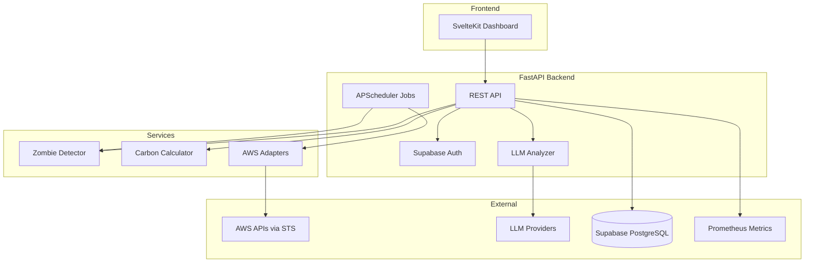
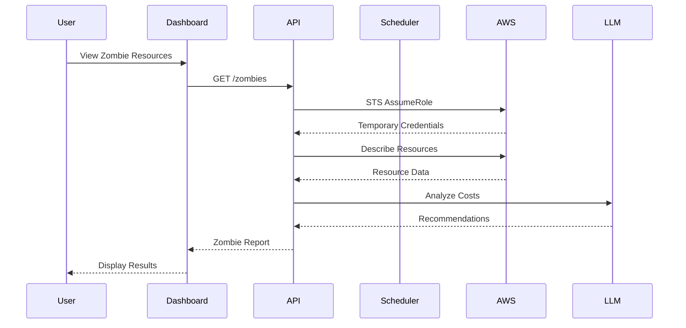

# Valdrix Architecture

## System Overview



## Component Descriptions

| Component | Description |
|-----------|-------------|
| **SvelteKit Dashboard** | User-facing web UI for viewing costs, zombies, carbon metrics |
| **FastAPI Backend** | Async Python API with Pydantic validation |
| **Supabase Auth** | JWT-based authentication and Row Level Security |
| **APScheduler Jobs** | Background jobs for daily scans and weekly remediation |
| **Zombie Detector** | Plugin-based detection of 11 AWS zombie resource types |
| **Carbon Calculator** | GreenOps metrics and Graviton migration recommendations |
| **LLM Analyzer** | AI-powered cost analysis via OpenAI/Claude/Groq |
| **AWS Adapters** | STS-based multi-tenant AWS access (no long-lived credentials) |

## Data Flow



## Security Model

- **Zero Trust**: No long-lived AWS credentials
- **STS AssumeRole**: Temporary credentials per request
- **Read-Only IAM**: Principle of least privilege
- **Human-in-the-Loop**: Remediation requires approval
- **Encrypted at Rest**: AES-256 via ENCRYPTION_KEY

## Plugin Architecture (Zombie Detection)

```
ZombiePlugin (ABC)
├── storage.py
│   ├── UnattachedVolumesPlugin
│   ├── OldSnapshotsPlugin
│   └── IdleS3BucketsPlugin
├── compute.py
│   ├── IdleInstancesPlugin
│   └── OrphanLoadBalancersPlugin
├── database.py
│   ├── IdleRdsPlugin
│   └── ColdRedshiftPlugin
├── network.py
│   ├── UnusedElasticIpsPlugin
│   └── UnderusedNatGatewaysPlugin
├── containers.py
│   └── LegacyEcrImagesPlugin
└── analytics.py
    └── IdleSageMakerPlugin
```
