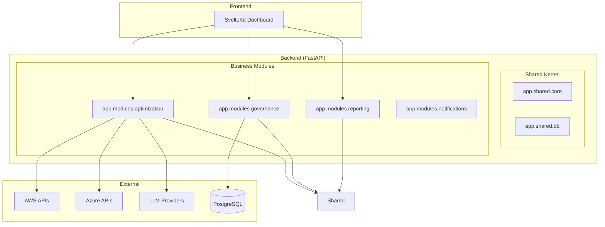

# Valdrix Enterprise Architecture
> **Elite SaaS Standard: Domain-Driven Modular Monolith**

## 🏛️ Architectural Philosophy

Valdrix is engineered as a **Modular Monolith** following **Domain-Driven Design (DDD)** and **Hexagonal (Ports & Adapters)** principles. This ensures the platform remains scalable, testable, and maintainable as it evolves from a single-cloud utility to a multi-cloud enterprise platform.

### Key Pillars
1.  **Modular Isolation**: Every business capability (Governance, Optimization, Reporting) is isolated into its own module.
2.  **Shared Kernel**: Common infrastructure logic is extracted to a centralized `shared` package.
3.  **Clean Boundaries**: Business logic (Domain) is strictly decoupled from infrastructure implementation (Adapters).

---

## 🏗️ System Overview

---

## 📂 Module Structure

Each module in `app/modules/` follows a standardized internal layout to enforce decoupling:

| Component | Responsibility |
| :--- | :--- |
| **`domain/`** | The "Core Brain". Contains pure Python logic, entities, and Port interfaces. **Zero external dependencies (like Boto3).** |
| **`adapters/`** | The "Infrastructure Layer". Implements Port interfaces to interact with AWS, Azure, GCP, or external APIs. |
| **`api/`** | The "Interface Layer". FastAPI routers, response schemas, and DTO mapping. |

---

## 🚀 Key Modules

### 1. Optimization (The Value Engine)
The core intelligence layer that detects zombie resources and calculates potential savings. 
- **Domain:** Rules-engine for identifying "Zombies" across compute, storage, and networking.
- **Adapters:** Cloud-specific scanners for AWS, Azure, and Google Cloud.

### 2. Governance (Operations & IAM)
Manages the "Safety" of the platform.
- **Onboarding:** Automated multi-tenant cloud connection setup.
- **Audit:** SOC2-compliant logging of all system and user actions.
- **Jobs:** Async background task orchestration via Celery/APScheduler.

### 3. Reporting (FinOps & GreenOps)
Aggregates raw statistics into actionable business intelligence.
- **Costs:** Spend attribution and ROI tracking.
- **Carbon:** GreenOps calculator using region-specific carbon intensity markers.

---

## 🔐 Security & Multi-Tenancy

- **Identity Isolation**: Valdrix utilizes **Supabase Auth** with strict **Row Level Security (RLS)** in the database.
- **Cloud Security**: No persistent AWS keys stored. Valdrix uses **AWS STS (AssumeRole)** to generate ephemeral, single-use credentials for every scan operation.
- **Data Protection**: Sensitive cloud configuration data is encrypted at rest using **AES-256**.
